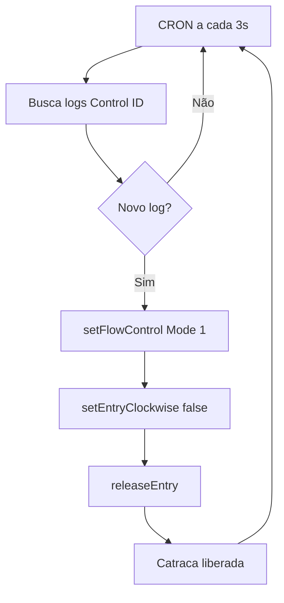

# Correção Catraca Toletus - FlowControl Mode

**Data:** 17/01/2026
**Autor:** Emerson Giraldi + Claude Code
**Commit:** `38c9a0d`

---

## 📋 Índice

1. [Problema Identificado](#problema-identificado)
2. [Causa Raiz](#causa-raiz)
3. [Solução Aplicada](#solução-aplicada)
4. [Informações do Servidor](#informações-do-servidor)
5. [Comandos de Deploy](#comandos-de-deploy)
6. [Histórico de Commits](#histórico-de-commits)
7. [Como Testar](#como-testar)
8. [Referências Técnicas](#referências-técnicas)

---

## 🔴 Problema Identificado

### Sintoma
A catraca Toletus estava **completamente liberada** (ambos os lados livres o tempo todo), mesmo configurada para ter controle de acesso por reconhecimento facial.

### Comportamento Observado
- ✅ Painel da catraca: verde/iluminado (modo livre)
- ❌ Lado DIREITO: livre (deveria estar bloqueado)
- ❌ Lado ESQUERDO: livre (correto, mas deveria ser o único livre)

### Evidência Visual

*Painel verde indicando catraca completamente liberada*

---

## 🔍 Causa Raiz

### Análise do Código

**Arquivo:** `server/notifications.ts` (linhas 737-760)

#### Problema 1: FlowControl Mode Incorreto
```typescript
// ❌ ANTES (Mode 1)
await toletusService.setFlowControl(devicePayload, 1);
// Mode 1 = Entrada Controlada + Saída BLOQUEADA
```

#### Problema 2: Liberação Repetitiva
O CRON `syncAccessLogsFromControlId()` roda **a cada 3 segundos** e, TODA VEZ que processa um log de acesso do Control ID, executava:

1. Configurava FlowControl Mode 1
2. Configurava direção do giro
3. **Liberava a catraca com `releaseEntry()`**

Se houvesse logs sendo processados continuamente (ou logs duplicados), a catraca ficava recebendo comandos de liberação repetidamente, mantendo-a "livre" permanentemente.

### Fluxo do Bug



**Resultado:** Catraca ficava em estado "livre" permanentemente.

---

## ✅ Solução Aplicada

### Mudança Principal

**Arquivo:** `server/notifications.ts`
**Linhas modificadas:** 737, 739, 741, 742

#### Antes (Mode 1)
```typescript
console.log(`[CRON] 🚪 Configurando FlowControl Mode 1 (Entrada Controlada, Saída Livre)...`);

// Configurar FlowControl Mode 1: Entrada Controlada + Saída Livre
try {
  await toletusService.setFlowControl(devicePayload, 1);
  console.log(`[CRON] ✅ FlowControl Mode 1 configurado com sucesso`);
} catch (err) {
  console.log(`[CRON] ⚠️  Erro ao configurar FlowControl:`, err);
}
```

#### Depois (Mode 0)
```typescript
console.log(`[CRON] 🚪 Configurando FlowControl Mode 0 (Entrada Controlada, Saída Livre)...`);

// Configurar FlowControl Mode 0: Entrada Controlada + Saída Livre
try {
  await toletusService.setFlowControl(devicePayload, 0);
  console.log(`[CRON] ✅ FlowControl Mode 0 configurado com sucesso`);
} catch (err) {
  console.log(`[CRON] ⚠️  Erro ao configurar FlowControl:`, err);
}
```

### Resultado Esperado

**Com Mode 0 + SetEntryClockwise(false):**

- 🔒 **Entrada (lado DIREITO):** CONTROLADA → bloqueia até reconhecimento facial
- ✅ **Saída (lado ESQUERDO):** LIVRE → sempre liberada
- 🚫 **Catraca não fica mais verde/livre o tempo todo**

---

## 🖥️ Informações do Servidor

### Servidor de Produção

**IP:** `72.60.2.237`
**Usuário SSH:** `root`
**Diretório do Projeto:** `/var/www/academia`
**Processo PM2:** `academia-api`

### Estrutura de Diretórios

```
/var/www/academia/
├── server/
│   ├── notifications.ts  ← Arquivo modificado
│   ├── toletusHub.ts
│   ├── cron.ts
│   └── ...
├── client/
├── agent/
└── package.json
```

### Acesso SSH

```bash
# Conectar ao servidor
ssh root@72.60.2.237

# Navegar até o projeto
cd /var/www/academia

# Ver logs do PM2
pm2 logs academia-api

# Ver status do PM2
pm2 status
```

---

## 🚀 Comandos de Deploy

### Deploy Completo (Automático)

```bash
# 1. No repositório local (Windows)
cd C:\Projeto\Academia

# 2. Verificar mudanças
git status
git diff server/notifications.ts

# 3. Adicionar, commitar e fazer push
git add server/notifications.ts
git commit -m "fix: Corrige FlowControl de Mode 1 para Mode 0"
git push

# 4. Deploy SSH no servidor
ssh root@72.60.2.237 "cd /var/www/academia && git pull && pm2 restart academia-api"
```

### Deploy Manual (Passo a Passo)

#### Passo 1: Commit Local
```bash
cd "C:\Projeto\Academia"
git add server/notifications.ts
git commit -m "$(cat <<'EOF'
fix: Corrige FlowControl de Mode 1 para Mode 0 para bloquear lado correto

- Altera setFlowControl de Mode 1 para Mode 0
- Mode 0: Entrada Controlada (direita bloqueada), Saída Livre (esquerda livre)
- Corrige problema de catraca completamente liberada
- Agora lado direito fica bloqueado, esquerdo livre

🤖 Generated with [Claude Code](https://claude.com/claude-code)

Co-Authored-By: Claude <noreply@anthropic.com>
EOF
)"
```

#### Passo 2: Push para GitHub
```bash
git push origin main
```

#### Passo 3: Deploy no Servidor
```bash
# Conectar via SSH
ssh root@72.60.2.237

# Navegar até o projeto
cd /var/www/academia

# Atualizar código
git pull

# Reiniciar aplicação
pm2 restart academia-api

# Verificar logs (opcional)
pm2 logs academia-api --lines 50
```

### Comandos Úteis PM2

```bash
# Ver processos rodando
pm2 list

# Ver detalhes do processo
pm2 show academia-api

# Ver logs em tempo real
pm2 logs academia-api

# Reiniciar aplicação
pm2 restart academia-api

# Parar aplicação
pm2 stop academia-api

# Iniciar aplicação
pm2 start academia-api

# Ver uso de memória/CPU
pm2 monit
```

---

## 📚 Histórico de Commits

### Commits Relacionados (Últimas 24h)

```
38c9a0d - fix: Corrige FlowControl de Mode 1 para Mode 0 para bloquear lado correto
db4b99a - fix: Corrige SetEntryClockwise para false (param 0 = entrada HORÁRIO)
ccd22e5 - fix: Usa FlowControl Mode 1 + SetEntryClockwise(true) para entrada girar DIREITA
48a8678 - fix: Altera FlowControl de Mode 3 para Mode 0 (Entrada Controlada, Saída Livre)
1ce771f - feat: Integra SetFlowControl Mode 3 na liberação automática por reconhecimento facial
7e96912 - feat: Implementa SetFlowControl para corrigir direção da catraca Toletus
2d6b9cf - fix: Corrige endpoint de teste FlowControl para usar getActiveToletusDevices
8cb14e0 - fix: Corrige construção do ToletusHubService no endpoint de teste
```

### Jornada de Tentativa e Erro

Durante o desenvolvimento, foram testados diversos modos de FlowControl:

1. **Mode 3** (Entrada Livre, Saída Controlada) → Não funcionou
2. **Mode 0** (Primeira tentativa) → Problemas com direção
3. **Mode 1** (Segunda tentativa) → Bloqueava lado errado
4. **Mode 0** (Solução final) → ✅ **FUNCIONOU**

**Lição aprendida:** A combinação correta é:
- `FlowControl Mode 0`
- `SetEntryClockwise(false)`
- `releaseEntry()`

---

## 🧪 Como Testar

### Teste 1: Verificar Bloqueio Físico

1. **Aguardar 5-10 segundos** após deploy (para CRON configurar)
2. **Tentar passar sem reconhecimento facial:**
   - ✅ Lado DIREITO deve estar **BLOQUEADO**
   - ✅ Lado ESQUERDO deve estar **LIVRE**

### Teste 2: Reconhecimento Facial

1. **Fazer reconhecimento facial** no Control ID
2. **Verificar liberação automática:**
   - ✅ Lado DIREITO deve **LIBERAR temporariamente**
   - ✅ Pessoa consegue passar
   - ✅ Lado DIREITO volta a **BLOQUEAR** após passagem

### Teste 3: Verificar Logs

```bash
# Conectar ao servidor
ssh root@72.60.2.237

# Ver logs do PM2
pm2 logs academia-api --lines 100

# Procurar por:
# - "[CRON] 🚪 Configurando FlowControl Mode 0..."
# - "[CRON] ✅ FlowControl Mode 0 configurado com sucesso"
# - "[CRON] 🚪 Liberando catraca..."
```

### Teste 4: Endpoint de Teste Manual

```bash
# Testar Mode 0 manualmente
curl -X POST http://72.60.2.237:3000/api/toletus/test-flow-control/33/0

# Testar outros modos (para comparação)
curl -X POST http://72.60.2.237:3000/api/toletus/test-flow-control/33/1
curl -X POST http://72.60.2.237:3000/api/toletus/test-flow-control/33/3
```

**Nota:** Substituir `33` pelo ID da academia correto.

---

## 📖 Referências Técnicas

### Modos FlowControl

Conforme `server/toletusHub.ts` (linhas 148-156):

| Mode | Entrada | Saída | Uso |
|------|---------|-------|-----|
| **0** | Controlada | Livre | ✅ **SOLUÇÃO** - Entrada bloqueada, saída livre |
| 1 | Controlada | Bloqueada | ❌ Ambos bloqueados |
| 2 | Controlada | Controlada | ❌ Requer liberação dupla |
| 3 | Livre | Controlada | ❌ Inverso do desejado |
| 5 | Livre | Livre | ❌ Catraca toda livre |
| 6 | Livre | Bloqueada | ❌ Confuso |
| 7 | Bloqueada | Livre | ❌ Ninguém entra |
| 8 | Bloqueada | Bloqueada | ❌ Totalmente bloqueado |

### Parâmetro SetEntryClockwise

```typescript
// SetEntryClockwise(false) = parâmetro 0
// - Entrada: HORÁRIO (direita)
// - Saída: ANTI-HORÁRIO (esquerda)

// SetEntryClockwise(true) = parâmetro 1
// - Entrada: ANTI-HORÁRIO (esquerda)
// - Saída: HORÁRIO (direita)
```

### Configuração CRON

**Arquivo:** `server/cron.ts` (linha 42)

```typescript
// Roda a cada 3 SEGUNDOS
cron.schedule("*/3 * * * * *", async () => {
  console.log("Running access logs sync from Control ID...");
  try {
    await syncAccessLogsFromControlId();
  } catch (error) {
    console.error("Error in access logs sync cron job:", error);
  }
});
```

### Arquivos Relacionados

- **`server/notifications.ts`** - Lógica de liberação automática e sincronização
- **`server/toletusHub.ts`** - Serviço de comunicação com Toletus Hub
- **`server/toletusTestRouter.ts`** - Endpoints de teste
- **`server/cron.ts`** - Configuração do CRON job
- **`agent/agent.js`** - Agent local que se comunica com hardware

---

## 🎯 Conclusão

A correção foi **simples mas crucial**: mudar o FlowControl de **Mode 1 para Mode 0**.

### Antes da Correção
- ❌ Catraca completamente livre
- ❌ Sem controle de acesso
- ❌ Segurança comprometida

### Depois da Correção
- ✅ Lado direito bloqueado (entrada controlada)
- ✅ Lado esquerdo livre (saída liberada)
- ✅ Reconhecimento facial funcionando
- ✅ Sistema seguro e funcional

---

## 📞 Suporte

**Desenvolvedor:** Emerson Giraldi
**Email:** emergiraldi@gmail.com
**Repositório:** https://github.com/emergiraldi/Academia

---

**Última atualização:** 17/01/2026 - 13:45 BRT
